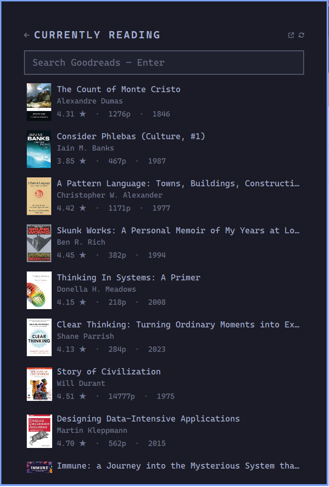

# Goodreads for Omarchy

A bar widget for [Omarchy](https://omarchy.org) 4.x that puts your Goodreads
shelves, book search, and community reviews one click away.



## What it does

- **Your shelves.** Every shelf on your profile — `read`, `currently-reading`,
  `to-read`, and any custom ones — with its book count.
- **A shelf's books.** Cover, title, author, your own star rating, the
  community average, page count and year. Paged, newest first.
- **Search that knows where you are.** Typing narrows the list in front of you
  *and* searches Goodreads, in two labelled sections — so looking for a book on
  your shelf and looking for one you don't own are the same gesture.
- **Book details and reviews.** Blurb, genres, edition details, rating
  breakdown, and the top community reviews with their stars, dates, and likes.
- **The bar pill** shows how many books are on the shelf you pick (default:
  `currently-reading`).

Clicking the ↗ in the header opens whatever you are looking at on
goodreads.com in your browser.

## Install

```bash
omarchy plugin add https://github.com/saftacatalinmihai/omarchy-goodreads.git --enable
```

Then click the bar pill and press **Connect Goodreads**. That is the whole
setup — no config file, no ID to look up, nothing to type.

## How connecting works

Goodreads retired its API (and its OAuth) in December 2020, so there is no
sign-in to perform. What the panel actually needs is the number in your profile
URL, and only your browser knows it. Connect gets it across in one step:

1. It checks your clipboard first. If your profile or shelf link is already
   there, you are connected immediately and no browser window opens.
2. Otherwise it opens `goodreads.com/review/list` — your My Books page. Signed
   in, Goodreads redirects that to `/review/list/<your-id>-<your-name>`. Signed
   out, it lands on the sign-in page and continues there once you log in.
3. Copy that address (Ctrl+L, then Ctrl+C). The panel is watching the clipboard
   and picks the ID out of it the moment it appears, confirms it against the
   live profile, and writes it into the bar config with `omarchy bar set`.

The watcher only ever reacts to Goodreads user URLs, ignores everything else,
and runs for five minutes before giving up. It reads no browser data — no
cookies, no history, no extension.

## How search works

The box at the top of the panel is always there, and what it does depends on
what is under it:

- **On a shelf** it filters that shelf under a `READ · 3 matches` heading, then
  lists Goodreads hits below under `ALL OF GOODREADS`.
- **On the shelf list** it filters your shelf names the same way, Goodreads hits
  underneath.
- **On a book** there is no list to narrow, so it goes straight to results.

Filtering is local and free, so it runs from the first letter with no delay.
The Goodreads request behind it waits 350ms and needs three letters, so a burst
of typing costs one request. Enter skips that wait. Clearing the box drops the
filter and puts back the paged shelf.

Matching ignores case, accents, and punctuation, and takes terms in any order —
`les mis` finds *Les Misérables*, `herbert dune` finds *Dune*.

**The filter covers the whole shelf, not the page on screen.** A shelf is shown
30 books at a time, but a filter that only searched those would answer "you
don't own that" about a book sitting on page 2. So the first keystroke pulls the
whole shelf once, 100 books per request — one request for most shelves — and
filters against that. Until it lands, the heading says `checking the whole
shelf…` and the visible page is filtered in the meantime.

## Requirements

Everything here ships with Omarchy already; there is nothing extra to install
and no API key to obtain.

| Needs | Why |
|---|---|
| `python3` | `bin/goodreads-cli` — standard library only, no pip packages |
| `curl` | every request to goodreads.com |
| `wl-clipboard` (`wl-paste`) | the Connect flow's clipboard watcher |

## Removing it

```bash
omarchy plugin disable safta.goodreads   # take it off the bar, keep it installed
omarchy plugin remove safta.goodreads    # uninstall it
rm -rf "${XDG_CACHE_HOME:-$HOME/.cache}/omarchy-goodreads"   # optional: drop the cache
```

The plugin writes nothing outside its own widget entry in
`~/.config/omarchy/shell.json` (the `userId` that Connect saves) and that cache
directory.

## Settings

| Setting | Default | Meaning |
|---|---|---|
| `userId` | — | Filled in by Connect. The number in your profile URL. |
| `rssKey` | — | Only needed if your profile is private; see below. |
| `defaultShelf` | `currently-reading` | Shelf the bar pill counts and the panel opens on. |
| `perPage` | `30` | Books per shelf page. |
| `reviewCount` | `10` | Reviews fetched per book. |
| `refreshSec` | `900` | How often the bar count refreshes. |
| `showCovers` | `On` | Cover art on or off. |

### Private profiles

A public profile needs nothing but the user ID. If your profile is private,
open one of your shelf pages on goodreads.com, find the RSS link at the bottom,
and copy the `key=` parameter out of it into the `rssKey` setting.

## How it gets the data

The official Goodreads API was retired in December 2020 and no new keys are
issued, so `bin/goodreads-cli` reads the site the way a browser does. It is
Python 3 standard library only, read-only, and shells out to `curl` (which
Omarchy already depends on):

| Command | Endpoint | Notes |
|---|---|---|
| `shelves` | `/user/show/<id>` | Shelf names and counts off the public profile. |
| `shelf` | `/review/list_rss/<id>` | The per-shelf RSS feed — ratings, covers, blurbs, dates. |
| `search` | `/book/auto_complete` | JSON. `/search` sits behind a bot check; this does not. |
| `book` | `/book/show/<id>` | Details and ~30 reviews out of the page's Apollo cache. |

Goodreads rate-limits scrapers, and `/book/show` is the page most likely to be
throttled. Two things soften that:

- **Caching.** Responses are cached under
  `${XDG_CACHE_HOME:-~/.cache}/omarchy-goodreads` — 5 minutes for shelves, an
  hour for searches, a day for book pages. The panel's ⟳ button bypasses it.
- **A fallback.** When `/book/show` is refused, the book view falls back to
  Goodreads' embeddable reviews widget, which is not gated. You still get
  reviews; the panel says the metadata is thinner than usual.

If you see "Goodreads served a bot check", wait a minute and hit ⟳.

## Using the CLI on its own

`bin/goodreads-cli` is a normal program and prints JSON on stdout:

```bash
./bin/goodreads-cli whoami --url https://www.goodreads.com/review/list/12345678-you
./bin/goodreads-cli shelves --user 12345678
./bin/goodreads-cli shelf --user 12345678 --shelf read --per-page 10
./bin/goodreads-cli search --query "the dispossessed"
./bin/goodreads-cli book --id 44767458 --reviews 5
./bin/goodreads-cli --no-cache shelves --user 12345678
```

Failures print `{"error": "..."}` and exit non-zero.

## IPC

The panel registers as `goodreads`:

```bash
omarchy-shell goodreads connect
omarchy-shell goodreads toggle
omarchy-shell goodreads shelf to-read
omarchy-shell goodreads search "ursula le guin"   # types into the box: filters and searches
omarchy-shell goodreads book 44767458
omarchy-shell goodreads refresh
```

## Keys

While the panel is open and the search box does not have focus: `Esc` closes,
`Enter` goes back a view, `Space` refreshes, `Tab` moves to the next bar panel.

## License

MIT.
